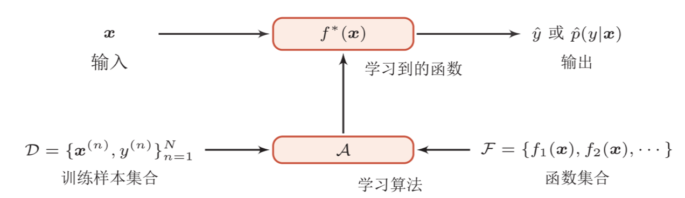
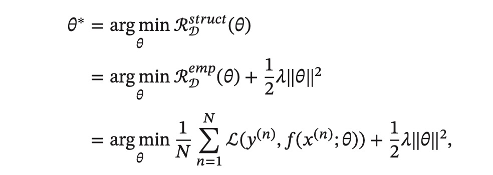
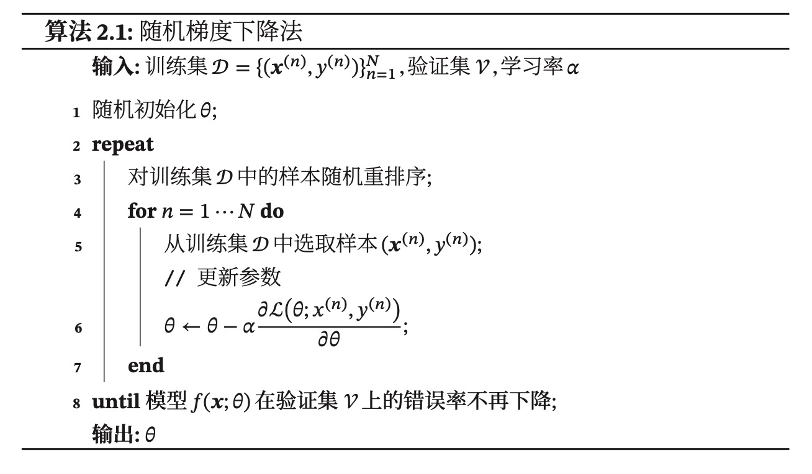

### 一、机器学习概述
> 机器学习是对能通过经验自动改进的计算机算法的研究 —— 汤姆·米切尔(Tom Mitchell)

**机器学习**：从数据中获得决策（预测）函数使得机器可以根据数据进行自动学习，通过算法使得机器能从大量历史数据中学习规律从而对新的样本做决策。

#### 1. 三个基本要素
模型、学习准则、优化算法
##### A. 模型 
* 线性模型
* 非线形模型

##### B. 学习准则
模型的好坏通过期望风险来衡量，但由于不知道真实的数据分布和映射函数，实际上无法计算期望风险，我们可以计算的是经验风险，即在训练集上的平均损失。
**机器学习问题转化为最优化问题**

###### 损失函数
* 0-1损失函数
* 平方损失函数
* 交叉熵损失函数
* Hinge损失函数

###### 风险最小化准则
* 经验风险最小化
容易导致**过拟合**（模型在训练集上错误率很低，但是在未知数据上错误率很高）
* 结构风险最小化
在经验风险最小化的基础上引入正则化项，避免过拟合。

##### C. 优化算法
机器学习的训练过程其实就是最优化问题的求解过程。
参数和超参数：参数可以通过优化算法进行学习，超参数是用来定义模型结构或优化策略的，通常按照人的经验设定。
* 梯度下降法
* 提前停止
防止过拟合。在训练集中分出一个验证集，如果在验证集上错误率不再下降就停止迭代。
* 随机梯度下降法

* 小批量梯度下降法
是批量梯度下降和随机梯度下降的折中，具有收敛快、计算开销小的优点。逐渐成为大规模的机器学习中的主要优化算法。

